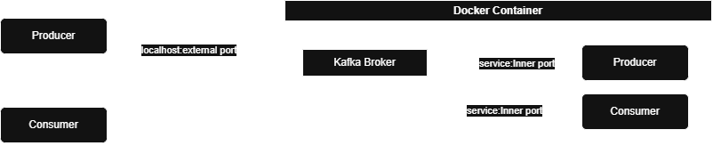
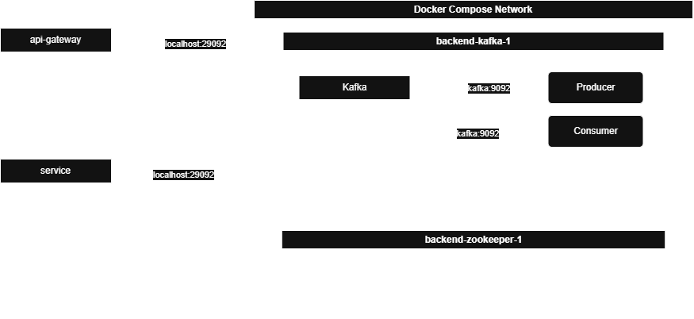
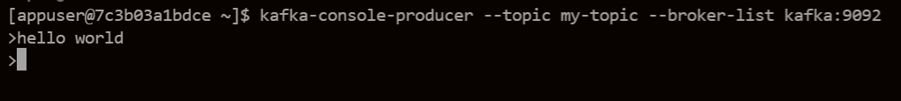
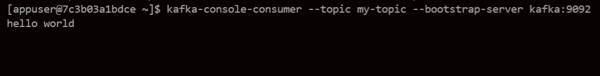

## kafka broker의 기본 통신


## 실제 서비스



## 실습

* ### 컨테이너 내부 통신

```bash
docker compose up --build
docker ps

d16229110a50   confluentinc/cp-zookeeper:latest   "/etc/confluent/dock…"   20 seconds ago   Up 19 seconds   2888/tcp, 0.0.0.0:2181->2181/tcp, [::]:2181->2181/tcp, 3888/tcp   backend-zookeeper-1
7c3b03a1bdce   confluentinc/cp-kafka:latest       "/etc/confluent/dock…"   2 hours ago      Up 2 hours      9092/tcp, 0.0.0.0:29092->29092/tcp, [::]:29092->29092/tcp         backend-kafka-1
```

* kafka container 접속

```bash
docker exec -it backend-kafka-1 bash
```

* topic 생성

```bash
kafka-topics --create --topic my-topic --bootstrap-server kafka:9092 --replication-factor 1 --partitions 1
```

```bash
Topic: my-topic TopicId: ck5VTac1Q0quJD40WgFZJw PartitionCount: 1       ReplicationFactor: 1    Configs: 
        Topic: my-topic Partition: 0    Leader: 1       Replicas: 1     Isr: 1  Elr: N/A        LastKnownElr: N/A
```

* consumer 생성

```bash
kafka-console-consumer --topic my-topic --bootstrap-server kafka:9092
```

* producer 생성

```bash
kafka-console-producer --topic my-topic --broker-list kafka:9092
```



